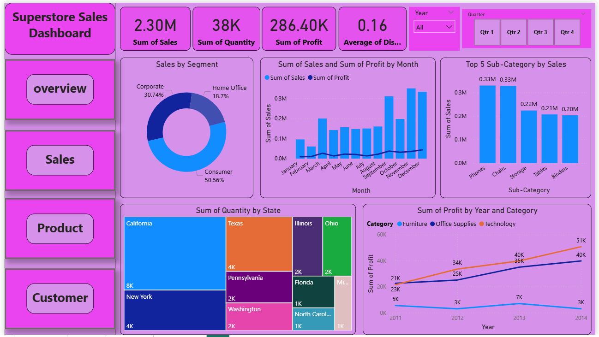
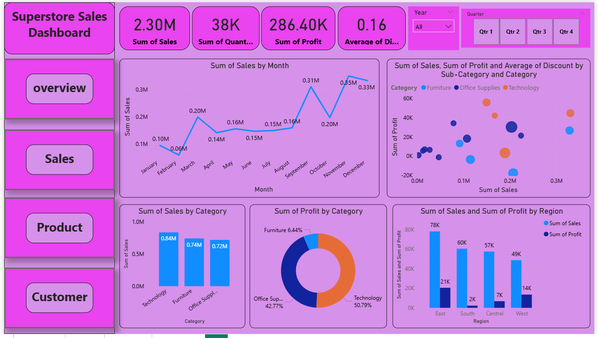
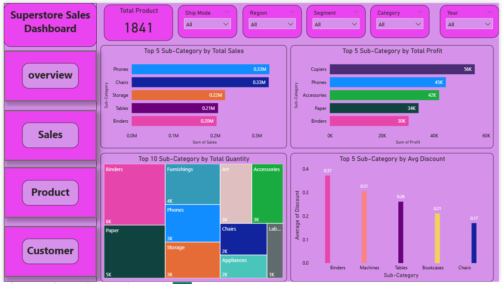
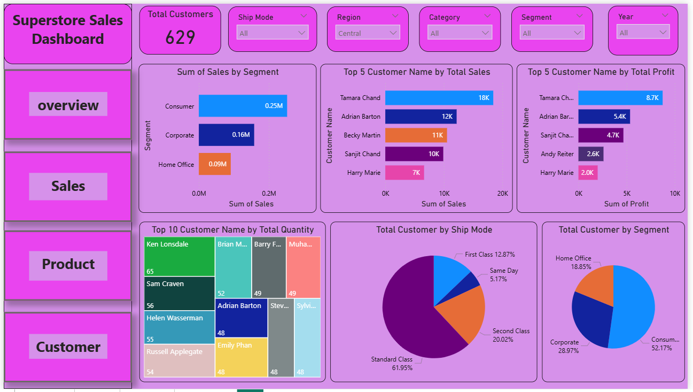

# 📊 FUTURE_DS_01

- Business Sales Dashboard — Superstore Sales Data
- Intern: Priyank Shrivastava | CIN: FIT/SEP25/DS7522
- Internship: Future Interns — Data Science & Analytics (Task 1)

---

# Project Overview

This project is a **Power BI Dashboard** built to analyze and visualize the **Superstore Sales dataset**.  
It provides key insights into sales, profit, quantity, customer behavior, and regional performance across different categories and segments.  

---

## 📂 Project Structure  
Superstore_Sales_Dashboard/
│
├── Dashboard/
│ └── Superstore_Sales_Dashboard.pbix # Power BI dashboard file
│
├── Datasets/
│ └── superstore.txt # Superstore dataset (text file)
│
└── README.md # Project documentation

---

## 📑 Key Insights  

- **Overall Performance:**  
  - Total Sales → 2.30M  
  - Total Quantity → 38K  
  - Total Profit → 286.40K  
  - Avg Discount → 16%  
  - Total Products → 1,841  
  - Total Customers → 629  

- **Segment Sales Contribution:**  
  - Consumer → 50.6%  
  - Corporate → 30.74%  
  - Home Office → 18.7%  

- **Time Analysis:**  
  - Q4 generates the highest sales YoY.  

- **Geographic Insights:**  
  - Top states by quantity: California, New York, Texas  
  - East region has the highest sales & profit; South region performs the lowest.  

- **Category & Sub-category Performance:**  
  - Technology has the highest sales & profit.  
  - Top Subcategories (Sales): Phones, Chairs, Storage  
  - Top Subcategories (Profit): Copies, Phones, Accessories  

---

## 💡 Skills Highlight  

This project demonstrates:  

- **Power BI Expertise** → Building dashboards, interactive visuals, and reports  
- **Data Analysis** → Cleaning, transforming, and deriving insights from raw data  
- **DAX & KPI Design** → Creating custom measures and metrics for business tracking  
- **Data Visualization** → Turning numbers into meaningful charts & dashboards  
- **Business Storytelling** → Communicating actionable insights for decision-making  
- **Problem-Solving Mindset** → Identifying trends, gaps, and opportunities from data  

---

## 🖼️ Dashboard Preview  

### 1. Overview Page  
  

### 2. Sales Page  
  

### 3. Product Page 
  

### 4. Customer Page
   

---

## 🗂️ Dashboard Pages / Navigation Overview  

The dashboard is structured into multiple pages for easy exploration:  

1. **Overview Page** – Displays KPIs (Total Sales, Profit, Quantity, Customers, etc.) and a high-level summary.  
2. **Sales Analysis** – Breaks down sales & profit by Consumer, Corporate, and Home Office.  
3. **Product Analysis** – Shows sales, profit, quantity, and averages for top products.  
4. **Customer Analysis** – Highlights sales, profit, quantity, and averages for top customers. 

---

## ⚙️ Tools & Technologies  

- **Power BI** → Dashboard design & data visualization  
- **Dataset** → Superstore Sales dataset (Text file)  

---

## 🚀 How to Use  

1. Download the repository.  
2. Open the `Superstore_Sales_Dashboard.pbix` file in **Power BI Desktop**.  
3. Explore interactive dashboards to analyze sales trends, profits, and customer behavior.  

---

## Author
- Name: Priyank Shrivastava
- Email: priyankshrivastava5678@gmail.com